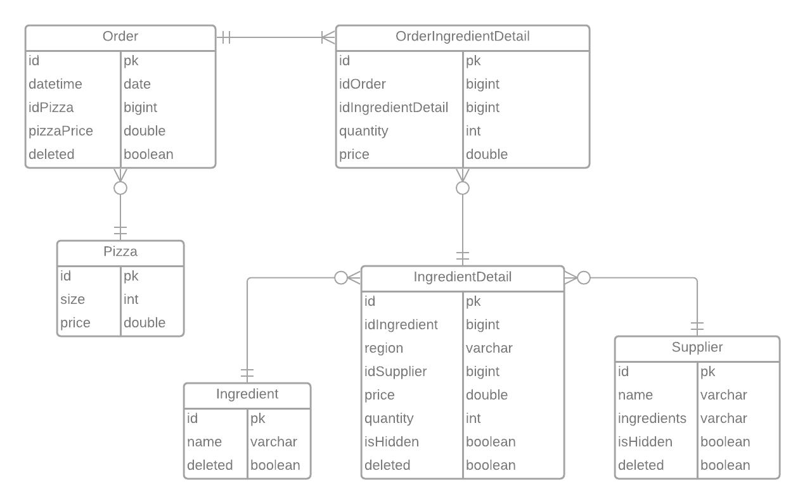
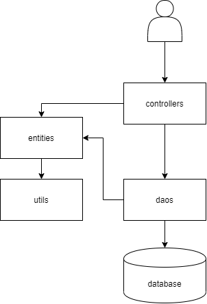

# Entity Relationship Diagram

# Packages Diagram

- **Controllers:** Is the package that receives all the request from the web clients. It is responsible to use the other packages of the system, to solve the request and generate the response to the user.
- **Entities:** Here we have the POJOs of the system. Just classes without behavior, for easier manipulation of the data in memory.
- **Daos:** This package is a middleware between the database and the application. All the communication with the database is made throw this package.
- **Utils:** Just a package with utilities to not repeat code. For example, here we have a function that receives an string and normalize it.

# Technologies Used

- **Spring Boot:** As the main framework to build the web application.
- **Spring MVC:** For request resolving essentially.
- **Thymeleaf:** For templating (inject data on the html docs, and execute loops and conditions)
- **HTML5, CSS and Javascript:** For the frontend.
- **AJAX:** To get the ingredient details in the ingredients page, without refreshing the page.
- **JDBC:** To connect with the database.
- **org.json:** For json parsing.
- **Maven:** For dependencies management.